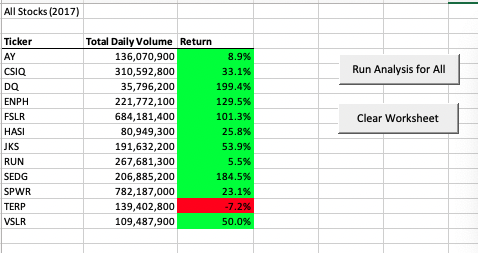
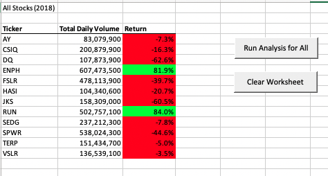
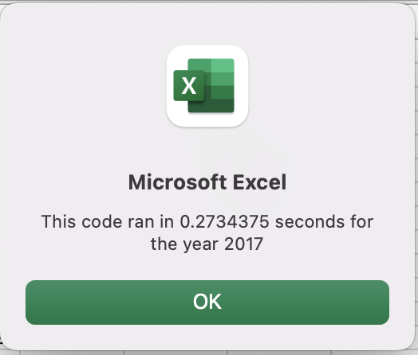
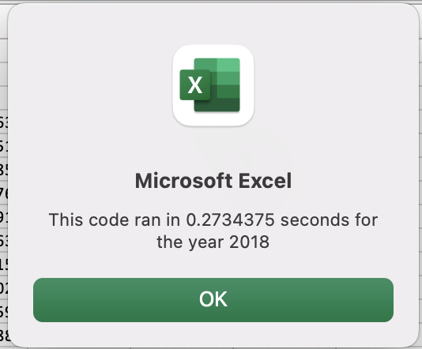
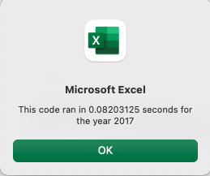
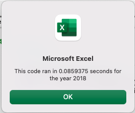

# Green Stock Analysis
## Overview
### Purpose
For this project, Steve was looking for an analysis of green stock performance over time. The initial analysis built with VBA macros in Excel analyzed the daily trading volume and stock price returns over a two-year period. Once the initial request was complete, I refactored, or edited, the scripts to run more efficiently, looping through all the data to reduce the run time for the analysis.

## Results
Because of the clear formatting of the returns column, **green** for positive returns, **red** for negative returns, it is clear that overall this set of stocks performed much better in 2017 as compared to 2018. Anyone familiar with the volatility stock market must always be reminded that past performance does not predict future results.

The original VBA script, in [this file](green_stocks.xlsm) returned the analysis in .27 seconds for both 2017 and 2018 analyses. 

The refactored script in [this file](VBA_Challenge.xlsm) returned the analysis in .082 seconds for the 2017 analysis and .086 seconds for the 2018 analysis, proving the refactored code was more efficient than the original source code.  

## Summary
Refactoring code, like this green stocks analysis, leads to better quality code, even though it doesn't add new functionality. Refactored code has the same outcome as the source code, but it more cleanly accomplishes the goal by eliminating some redundant steps. Clearly documenting the code with comments and indents will also make it easier to understand when looking back at the code at a later date. A potential disadvantage of refactoring, is any time working code is edited, there's a risk of breaking a once working solution. I made several minor errors while refactoring that I needed to debug for my analysis to run correctly. I could also see times where its imperative to deliver a working solution and a project may not have the time or budget to spend refactoring the code at the initial delivery.

How do these pros and cons apply to refactoring the original VBA script? What advantages of the original? 
Refactoring the original green stocks VBA script improved the script run time significantly. While the time results may not seem vast upon initial comparison, the code is now better suited to process a much larger data set, like comparing more than 12 stock tickers or more than the two years of data used in this analysis. The difference in computing speed would certainly compound and the code would run more efficiently. 
